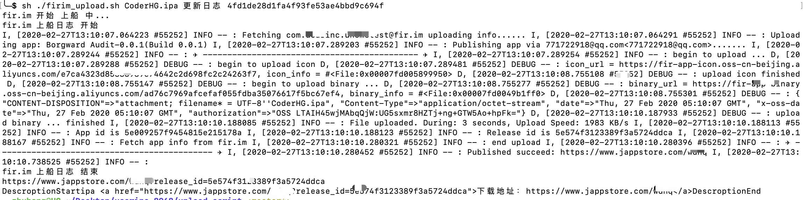
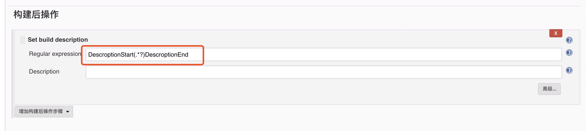

# upload_script
 
脚本详情， 请查阅 [firim_upload.sh](./firim_upload.sh)。   
## 上船样例  
   

## 中心思想
### 1、通过脚本方便上船 **apk** 或者 **ipa** 文件。
    
### 2、拼接当前上传的文件的下载地址。  
因为每次上传之后上船的下载地址是不一样的,通过观察发现需要拼接一个 release_id（详情见脚本）。这样做的目的是方便找到对应的打包下载页，预知具体原因请看下一条。 
 
### 3、完美的结合 Jenkins 的使用。  
看完了脚本代码以后，你会发现与 Jenkins 貌似没有半点关系，其实是有关系的，主要是最后一个 **echo** 的打印内容。看注释就知道是需要结合 Jenkins 的 **descroption** 功能一起使用的。

### 4、在 Jenkins 中使用的效果
   
这样做了之后，是不是就很容易的找到当前打包对应的下载地址了（ **注意** ：显示的地址是固定地址，但是 href 的值是当前包对应的下载地址）。  
当然需要在 Jenkins 中做对应的设置：  
     
**注意** ： DescroptionStart(.*?)DescroptionEnd 是与脚本中最后一行打印一一对应的。   

## 怎么样，能得到一个 star 么？谢谢！
